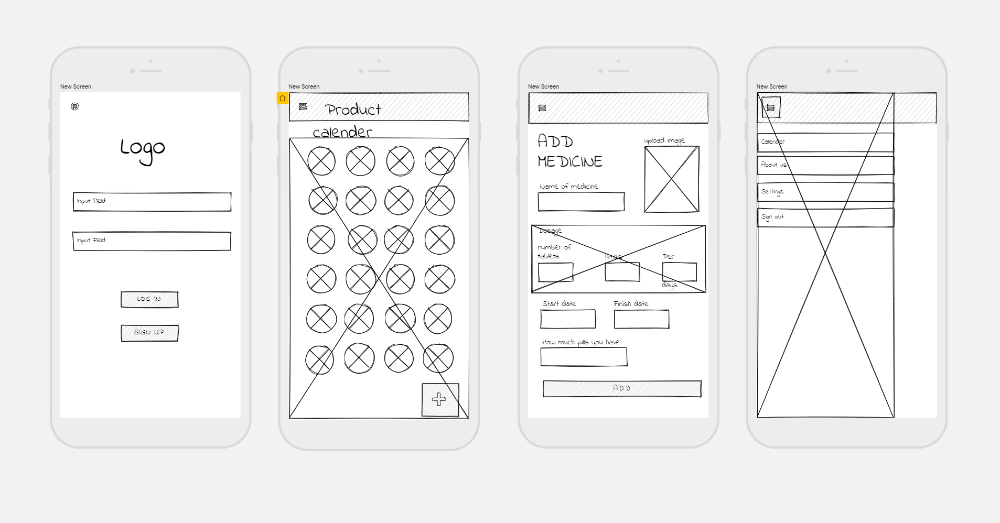
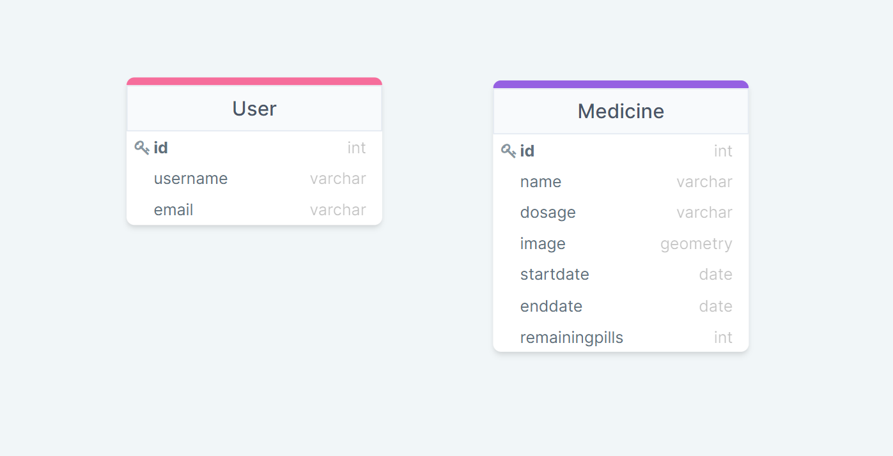

## **Project requirements:**
The main feature in the application is to remind the user to take his pills at the right times, he enters the medicine information with the right dosage and time, to then get notified by the application 15 minutes prior the medicine time, and to pop an alarm 1 minute before.

It will record if the medicine at that day was taken either on time, late or missed. It will keep track of all the medicine throughout the days, and it save a medical record for the user in case he needed it.

#### ***Wireframe***

#### ***Schema***

